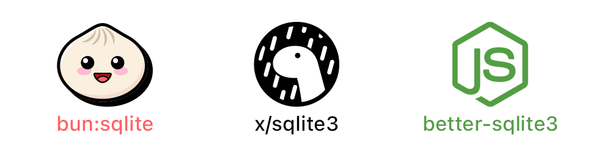
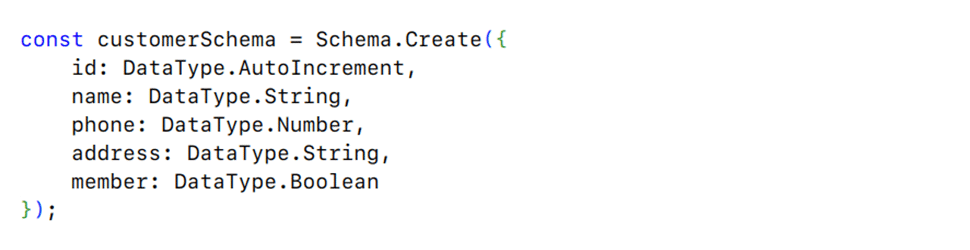

# great.db

⚡ A powerful, human-friendly database library for JavaScript using SQLite. A completely different approach is taken to create this library which strives to change the way we use SQLite in JavaScript forever.

- Elegant way to set and retrieve data
- Robust functions to perform operations
- Complete typescript support

## Bun? Deno? Node.js? We got all.

great.db uses [runtimey](https://github.com/tr1ckydev/runtimey) to automatically detect which runtime you are using and uses the respective fastest SQLite library available under the hood. One code base working differently on different runtimes to provide the best experience. Isn't that *great* ?

> **Note:** When using great.db in Deno, `-A --unstable` flags need to be passed for `x/sqlite3` to work. [Learn more](https://github.com/denodrivers/sqlite3#usage).

## Documentation and Examples

Seems interesting? Great! Head over to the [documentation](DOCUMENTATION.md) to learn everything about it.

Done reading? Now, check out the [examples](https://github.com/tr1ckydev/great.db/tree/main/examples) to get started.

## Salient Features

- ### **Inserting/Updating data has never been easier**

  Insert or update data with a breeze through simple objects, one or multiple. [Learn more](https://github.com/tr1ckydev/great.db/blob/main/DOCUMENTATION.md#set-----promisevoid).

  

- ### **Use schemas to describe shape of your table**

  Schema is a way to define how your table columns should be. Define your own schemas using various data types or use a built-in preset to quickly get started. [Learn more](https://github.com/tr1ckydev/great.db/blob/main/DOCUMENTATION.md#schema).

  

- ### **Strong typescript support out of the box**

  Typescript types get auto magically inferred from the schema created to give auto-completions on the fly everywhere.

  

## License

great.db uses MIT License. See [LICENSE](https://github.com/tr1ckydev/great.db/blob/main/LICENSE) for full license text. great.db also uses external libraries that are available under a variety of licenses.
